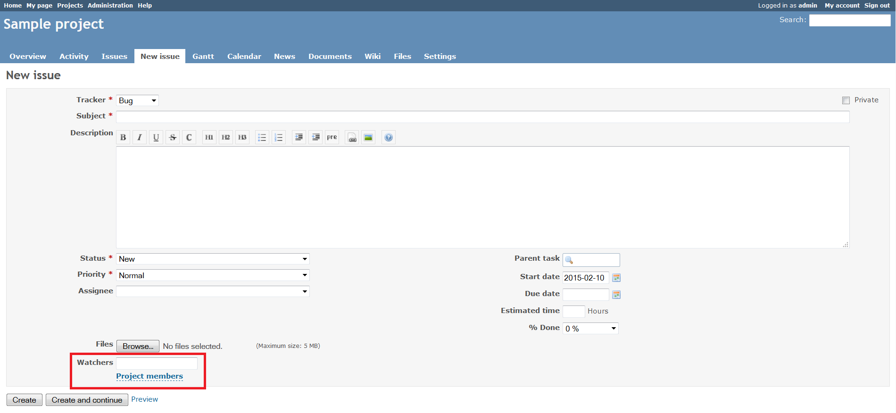
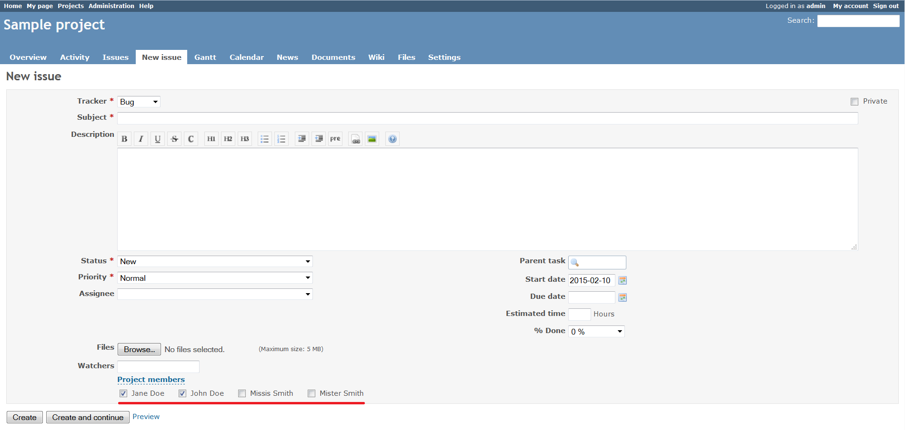
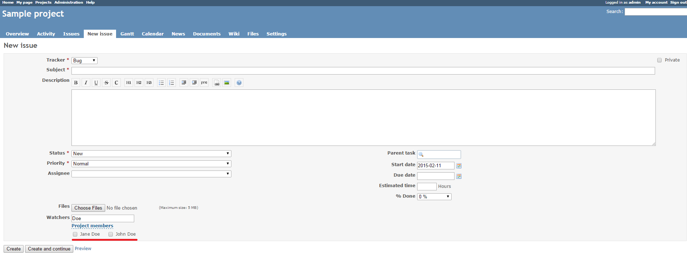
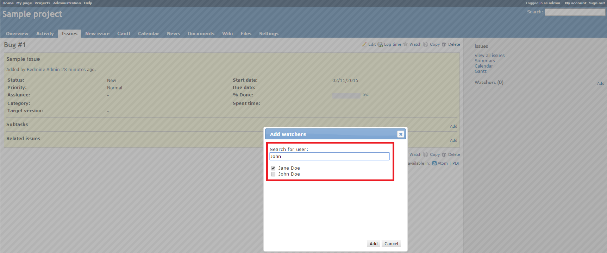

# Redmine Undev Watchers Plugin

This plugin makes selection of issue watchers easier and more convenient.

## Installation

*These installation instructions are based on Redmine 2.x. For instructions for previous versions, see [Redmine wiki](http://www.redmine.org/projects/redmine/wiki/Plugins).*

1. To install the plugin
    * Download the .ZIP archive, extract files and copy the plugin directory into #{REDMINE_ROOT}/plugins.
    
    Or

    * Change you current directory to your Redmine root directory:  

            cd {REDMINE_ROOT}
            
      Copy the plugin from GitHub using the following command:
      
            git clone https://github.com/Undev/redmine_undev_watchers.git plugins/redmine_undev_watchers
            
2. Install the required gems using the command:  

        bundle install  

    * In case of bundle install errors, remove the Gemfile.lock file, update the local package index and install the required dependencies. Then execute the `bundle install` command again:  

            rm Gemfile.lock
            sudo apt-get update
            sudo apt-get install -y libxml2-dev libxslt-dev libpq-dev
            bundle install
            
3. Restart Redmine.

Now you should be able to see the plugin in **Administration > Plugins**.

## Usage

The plugin adds the **Project members** link under the **Watchers** field in the issue description.  

Click the **Project members** link and select the required check boxes. The selected users will be added as watchers of the issue.  

If you type a part of a user's name, login or email in the **Watchers** field, only members that match the search word will be displayed under the **Project members** link.  

The plugin also improves the logic of adding watchers to the existing issues. When you select a user in the **Add watchers** pop-up window and then search for another one, the selected user is no longer hidden in the search results.  

## License

Copyright (c) 2015 Undev

Licensed under the Apache License, Version 2.0 (the "License");
you may not use this file except in compliance with the License.
You may obtain a copy of the License at

http://www.apache.org/licenses/LICENSE-2.0

Unless required by applicable law or agreed to in writing, software
distributed under the License is distributed on an "AS IS" BASIS,
WITHOUT WARRANTIES OR CONDITIONS OF ANY KIND, either express or implied.
See the License for the specific language governing permissions and
limitations under the License.